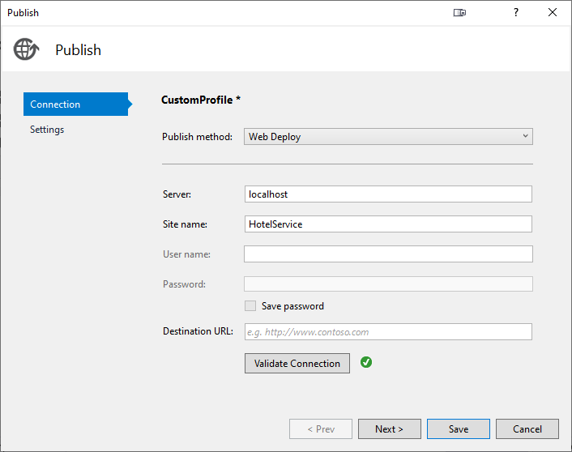
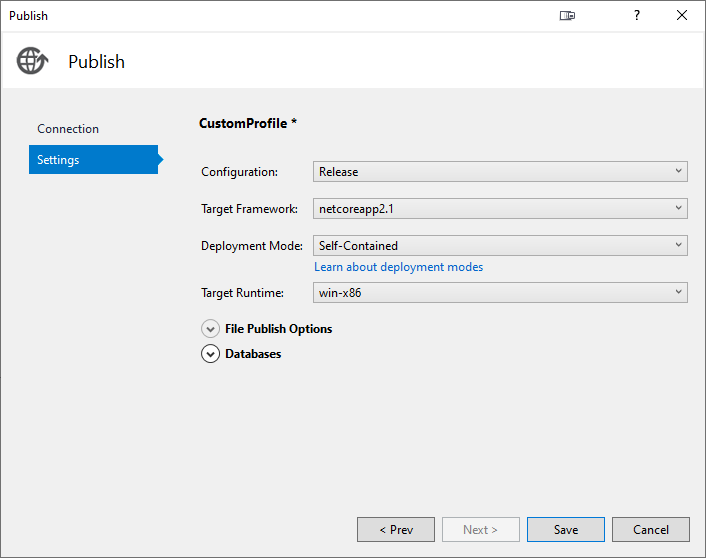
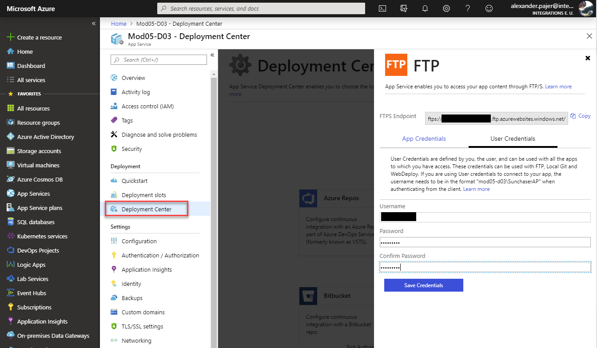

# Module 5: Hosting Services On-Premises and in Azure

1. Wherever a path to a file starts at _[Repository Root]_, replace it with the absolute path to the directory in which the 20487 repository resides. For example, if you cloned or extracted the 20487 repository to **C:\Users\John Doe\Downloads\20487**, change the path: \*[Repository Root]**\*\AllFiles\20487D\Mod01 to C:\Users\John Doe\Downloads\20487\AllFiles\20487D\Mod01**.
2. Wherever _{YourInitials}_ appears, replace it with your actual initials. For example, the initials for **John Doe** will be **jd**.
3. Before performing the demonstration, you should allow some time for the provisioning of the different Microsoft Azure resources required for the demonstration. You should review the demonstrations before the actual class, identify the resources, and then prepare them beforehand to save classroom time.

# Lesson 1: Hosting Services On-Premises

### Demonstration: Hosting Services On-Premises by using Windows Services with Kestrel (RunAsService)

#### Demonstration Steps

1. Open the Command Prompt window as an administrator.
   > **Note**: In the User Account control dialog box, click **Yes**.
2. At the command prompt, paste the following command, and then press Enter:
   ```bash
      cd [Repository Root]\Allfiles\Mod05\DemoFiles\HostInWindowsService
   ```
3. To publish the **ASP .NET Core** project into a folder, paste the following command, and then press Enter:
   ```bash
     dotnet publish --configuration Release --output [Repository Root]--output ../publish
   ```
4. To create the **Windows** service, paste the following command, and then press Enter:

   ```bash
     sc create HotelsService binPath= "[Repository Root]\Allfiles\Mod05\DemoFiles\Host In Windows Service\BlueYonder.Hotels.Service.exe"
   ```

   > Note: Run as Administrator on Windows

5. To start the **Windows** service, paste the following command, and then press Enter:
   ```bash
     sc start HotelsService
   ```
6. To verify that the service is working, open the browser and go to **http://localhost:5000/api/values**.
7. To stop the **Windows** service, paste the following command, and then press Enter:
   ```bash
     sc stop HotelsService
   ```
8. Close the **Administrator: Command Prompt** window.

   > Note: To Delete the service execute: `sc delete HotelsService`

### Demonstration: Hosting ASP.NET Core Services in IIS

#### Demonstration Steps

1. Click **Start** menu, in the search box type **IIS** and from the search results select **Internet Information Services(IIS) Manager**.
2. In the menu on the left side, expand the **Desktop**, right-click the **Sites** folder, and then select **Add Website..**.
3. In the **Add Website** dialog box, in the **Site name** box, type **HotelsSite**.
4. In the **Content Directory** section, in the **Physical path** box, type [Repository Root]**\Allfiles\Mod05\DemoFiles\Host in IIS**.
5. In the **Binding** section, change the value in **Port** from **80** to **8080**.
6. To create your new website, click **OK**.
7. In the menu on the left side, click **Application Pools**, and then double-click the website that you just created.
8. In the **.NET CLR version** list, select **No Managed Code**, and then click **OK**.
9. Close **Internet Information Services(IIS) Manager**.
10. Open Microsoft Visual Studio 2017 as an administrator.
    > **Note**: In the User Account control dialog box, click **Yes**.
11. In **Microsoft Visual Studio(Administrator)**, on the **File** menu, point to **Open**, and then click **Project/Solution**.
12. In the **Open Project** dialog box, browse to [Repository Root]**\Allfiles\Mod05\DemoFiles\Host in IIS**, click **BlueYonder.Hotels.Service.sln**, and then click **Open**.
    > **Note**: If Security Warning for BlueYonder.Hotels.Service dialog box appears clear Ask me for every project in this solution check box and then click **OK**.
13. Right-click **BlueYonder.Hotels.Service**, and then select **Publish**.
14. In the **Publish** blade, select **IIS, FTP, etc**, in right pane from the **Publish** drop down list select **Create Profile**.
15. In the **Publish** window, in the **Server** box, type **localhost**.
16. In the **Site name** box, type **HotelsSite**, and then click **Next**.
17. In the **Settings** pane, in the **Deployment Mode** list, select **Self-Contained**.
18. In the **Target Runtime** list, select **win-x64**, and then click **Save**.
19. In the **Publish** blade, click **Publish**.
20. Wait until the process is complete.
21. Open the browser and browse to **localhost:8080/api/Values**. Check that you are getting the expected response such as the following:

    ```json
    ["value1", "value2"]
    ```

    

    

    > Note: Make sure you have the correct Hosting Bundle installed

    

# Lesson 2: Hosting Services in Web Apps Feature of Azure App Service

### Demonstration: Hosting ASP.NET Core Web APIs in Web Apps

1. Open Microsoft Azure Portal.
2. If a page appears asking for your email address, enter your email address, and then click **Continue**. Wait for the sign-in page to appear, enter your email address and password, and then click **Sign In**.

   > **Note**: During the sign-in process, if a page appears asking you to choose from a list of previously used accounts, select the account that you previously used, and then continue to provide your credentials.

3. If the **Windows Azure Tour** dialog box appears, to close it, click **X**.
4. In the navigation blade, click **App Services**.
5. To create a new app service, in the menu at the top, click **Add**.
6. In the **Web** blade, in the **Web Apps** section, select **Web App**, and then click **Create**.
7. In the **App name** box, enter a unique name.
8. Copy the **App name** value to any code editor.
9. Click **App service plan/Location**, and then click **Create new**.
10. From the **Location** list, select the region that is closest to your location.
11. In the **App Service plan** box, type **MyAppService**, and then click **OK**.
12. Click **Create**. Wait for the web app to be created. Click the newly created web app.
13. In the newly created web app blade, in the **Deployment** section, click **Deployment Center**, select **FTP** and then Click **Dashboard**.
14. In the **FTP** pane, click **User Credentials**, in the **username** box enter a unique name.
15. In the **Password** and **Confirm password** inputs, enter a new password.

    > **Note**: You will need these credentials for the next steps. Copy them to any code editor.

16. In the newly created web app, click **Overview**.
17. Open the Command Prompt window.



18. To change directory to **HostInAzure** folder, run the following command:
    ```bash
    cd [Repository Root]\Allfiles\Mod05\DemoFiles\HostInAzure
    ```
19. At the command prompt, paste the following command to create a new web app and then press Enter:
    ```bash
      dotnet new webapi --name BlueYonder.Hotels.Service --output "[RepositoryRoot]\Allfiles\Mod05\DemoFiles\HostInAzure"
    ```
20. Open File Explorer and browse to \*[RepositoryRoot]**\*\Allfiles\Mod05\DemoFiles\HostInAzure**.
21. In the **Properties** folder, create a new folder **PublishProfiles**.
22. In the **PublishProfiles** folder, create a new file called **Azure** with the extension **.pubxml**.
23. Open the file in any code editor and paste the following XML content to define the publish settings:

    ```xml
    <Project>
        <PropertyGroup>
        <PublishProtocol>Kudu</PublishProtocol>
        <PublishSiteName>{Your App name}</PublishSiteName>
        <UserName>{Your FTP/deployment username}</UserName>
        <Password>{Your FTP/deployment password}</Password>
        </PropertyGroup>
    </Project>
    ```

24. Replace the **PublishSiteName**, **UserName** and **Password** values with the values that you have copied earlier.
25. Save the file.
26. To point to your new web app folder, at the command prompt, paste the following command:
    ```bash
        cd [RepositoryRoot]\Allfiles\Mod05\DemoFiles\HostInAzure
    ```
27. To host your web app in an app service that you created in Azure, paste the following command:
    ```bash
        dotnet publish /p:PublishProfile=Azure /p:Configuration=Release
    ```
28. Open a browser and browse to **https://{Your App Name}.azurewebsites.net/api/values**.

> **Note**: Replace _{Your App Name}_ with your actual app name that you have copied earlier.

29. Check whether you are getting the expected response such as the following:
    ```json
    ["value1", "value2"]
    ```

# Lesson 3: Packaging Services in Containers

### Demonstration: Creating an empty ASP.NET Core Docker container

1. Open the Command Prompt window.
2. To launch a default **ASP.NET Core** container that listens on a default port, at the command prompt, paste the following command:
   ```bash
   docker run -it --rm -p 8000:80 --name aspnetcore_sample microsoft/dotnet-samples:aspnetapp
   ```
3. Open a browser and navigate to **localhost:8000**.
4. Verify that you are getting the default **ASP.NET Core** starter page.
5. Close all open windows.

### Demonstration: Publishing into a Container

1. Open the Command Prompt window.
2. To create a new Web App, at the command prompt, paste the following command, and then press Enter:
   ```bash
     dotnet new webapi --name BlueYonder.Hotels.Service --output [RepositoryRoot]\Allfiles\Mod05\DemoFiles\Host_In_Docker
   ```
3. To change the directory to the **Host_In_Docker** folder, at the command prompt, run the following command:
   ```bash
   cd [RepositoryRoot]\Allfiles\Mod05\DemoFiles\Host_In_Docker
   ```
4. To open the project in Microsoft Visual Studio Code, run the following command:
   ```bash
   code .
   ```
5. In the **EXPLORER** panel, right-click the **Host_In_Docker** area, select **New File**, and then name it **Dockerfile**
6. To download a base docker image for **ASP.NET CORE** and define docker settings for your **BlueYonder.Hotels.Service** project, open the new **DockerFile** and, paste the following docker commands:

   ```
       FROM microsoft/dotnet:2.1-aspnetcore-runtime AS base
       WORKDIR /app

       EXPOSE 55419
       EXPOSE 44398

       FROM microsoft/dotnet:2.1-sdk AS build
       WORKDIR /src
       COPY Host_In_Docker/BlueYonder.Hotels.Service.csproj Host_In_Docker/
       RUN dotnet restore Host_In_Docker/BlueYonder.Hotels.Service.csproj
       COPY . .
       WORKDIR /src/Host_In_Docker
       RUN dotnet build BlueYonder.Hotels.Service.csproj -c Release -o /app

       FROM build AS publish
       RUN dotnet publish BlueYonder.Hotels.Service.csproj -c Release -o /app

       FROM base AS final
       WORKDIR /app
       COPY --from=publish /app .
       ENTRYPOINT ["dotnet", "BlueYonder.Hotels.Service.dll"]
   ```

7. To locate the parent folder for your project, at the command prompt, paste the following command, and then press Enter:
   ```bash
       cd [RepositoryRoot]\Allfiles\Mod05\DemoFiles\
   ```
8. To build your project by using **DockerFile** that you created earlier, paste the following command, and then press Enter:
   ```bash
       docker build -t hotels_service -f Host_In_Docker\DockerFile .
   ```
9. To run the docker container which is listening on a default port, paste the following command, and then press Enter:
   ```bash
       docker run --rm -it -p 8080:80 hotels_service
   ```
10. Open a browser and navigate to **localhost:8080/api/values**.
11. Check that you are getting the expected response such as the following:
    ```json
    ["value1", "value2"]
    ```
12. Run **Docker Client** on your machine and sign in by using your Docker Hub credentials.
13. To sign in to Docker Hub by using the command line, paste the following command:

    ```bash
        docker login
    ```

    > **Note**: Enter your Docker Hub username and password, and then press Enter.

14. To create a tag name for your docker image in Docker Hub, paste the following command, and then press Enter:
    > **Note**: Replace the _{Your Docker Hub Username}_ variable with your actual Docker Hub username.
    ```bash
        docker tag hotels_service {Your Docker Hub Username}/hotels_service
    ```
15. To push your container image into Docker Hub, paste the following command, and then press Enter:

    > **Note**: Replace the _{Your Docker Hub Username}_ variable with your actual Docker Hub username.

    ```bash
        docker push {Your Docker Hub Username}/hotels_service
    ```

16. Open a browser, navigate to **https://hub.docker.com**, and then sign in with your credentials.
17. On the **Repositories** page, verify that you are seeing the last push as \*{Your Docker Hub UserName}**\*/hotels_service**.
18. To pull your docker image from Docker Hub, paste the following command, and then press Enter:

    > **Note**: Replace the _{Your Docker Hub Username}_ variable with your actual Docker Hub username.

    ```bash
        docker pull {Your Docker Hub Username}/hotels_service
    ```

19. To see all the local and remote images that exist on your machine, paste the following command, and then press Enter:
    ```bash
        docker images
    ```
20. Verify that you are seeing both local and remote **hotels_service** images.
21. To run the remote docker image on your machine, paste the following command, and then press Enter:
    ```bash
        docker run -p 4000:80 {Your Docker Hub Username}/hotels_service
    ```
22. Open a browser and navigate to **localhost:4000/api/values**.
23. Check that you are getting the expected response such as the following:
    ```json
    ["value1", "value2"]
    ```
24. Close all open windows.

# Lesson 4: Implementing Serverless Services

### Demonstration: HTTP-triggered Azure Function

1. Open the Microsoft Azure Portal.
2. If a page appears asking for your email address, enter your email address, and then click **Continue**. Wait for the sign-in page to appear, enter your email address and password, and then click **Sign In**.

   > **Note**: During the sign-in process, if a page appears asking you to choose from a list of previously used accounts, select the account that you previously used, and then continue to provide your credentials.

3. If the **Windows Azure Tour** dialog box appears, to close it, click **X**.
4. In the navigation blade, click **Create a resource**.
5. In the **New** window, select **Compute**, and then select **Function App**.
6. In the **Function App** blade, in the **App name** box, enter a globally unique name.
7. From the **Location** list, select the region that is closest to your location.
8. Set **Application Insights** to **Off**.
9. Click **Create**. Wait for the Function app to be created. Click the newly created Function app.
10. In the newly created Function app blade, click the **+** sign near the **Functions** section.
11. In the new **function** blade, verify that **Webhook + API** is selected as the scenario and **CSharp** is selected as the language.
12. Click **Create this function**.
13. In your new **function** blade, at the top right, click **</> Get function URL**, select **default (Function key)**, and then click **Copy**.
14. Paste the function URL in your browser's address bar and add the following query string value to the end of this URL, and then press Enter to run the request:
    ```cs
        &name=<yourname>
    ```
    > **Note**: Replace _<yourname>_ variable with your actual name.
15. Check that you are getting the expected response such as the following:

    ```cs
       "Hello {Your Name}"
    ```

    > **Note**: This is the response from Microsoft Edge. Other browsers may include displayed XML.

16. To see the trace output from the previous execution, return to your function in the portal and click the arrow at the bottom of the screen to expand the **Logs**.

### Demonstration: Developing, Testing, and Publishing an Azure Function from CLI

1. Open the Azure Portal.
2. If a page appears asking for your email address, enter your email address, and then click **Continue**. Wait for the sign-in page to appear, enter your email address and password, and then click **Sign In**.

   > **Note**: During the sign-in process, if a page appears asking you to choose from a list of previously used accounts, select the account that you previously used, and then continue to provide your credentials.

3. If the **Windows Azure Tour** dialog box appears, to close it, click **X**.
4. In the navigation blade, click **Create a resource**.
5. In the **New** window, select **Compute**, and then select **Function App**.
6. In the **Function App** blade, in the **App name** box, enter a globally unique name.
   > **Note**: Save the App name in any code editor. You will need it when publishing a new **Azure Function** to **Azure**.
7. From the **Location** list, select the region that is closest to your location.
8. Set **Application Insights** to **Off**.
9. Click **Create**. Wait for the Microsoft Azure Functions app to be created.
10. Open the Command Prompt window.
11. To change the directory, at the command prompt, paste the following command, and then press Enter:

    ```bash
        cd [RepositoryRoot]\AllFiles\Mod05\DemoFiles\AzureFunctions
    ```

    > **Note**: Make sure you have Azure Functions Core Tools (`npm install -g azure-functions-core-tools`) installed. Reference [here](https://docs.microsoft.com/en-us/azure/azure-functions/functions-run-local#v2)

12. To create a local Functions project, paste the following command:
    ```bash
        func init MyAzureFunctionProj -n --worker-runtime dotnet
    ```
13. To change the directory to the new Functions project folder, paste the following command, and then press Enter:
    ```bash
        cd MyAzureFunctionProj
    ```
14. To create a new Azure function for your new Functions project, paste the following command, and then press Enter:
    ```bash
        func new --language C# --template "HttpTrigger" --name MyAzureFunc
    ```
15. To test the new Azure function locally, paste the following command, and then press Enter:
    ```bash
        func host start --build
    ```
    > **Note**: If windows Security Alert dialog box appears click **Allow access**.
16. Open a browser and navigate to **http://localhost:7071/api/MyAzureFunc**.
17. Add the following query string value to the end of this URL, and then press Enter to execute the request:
    ```cs
        ?name=<yourname>
    ```
    > **Note**: Replace _<yourname>_ variable with your actual name.
18. Check that you are getting the expected response such as the following:

    ```cs
       "Hello {Your Name}"
    ```

    > **Note**: This is the response from Microsoft Edge. Other browsers may include displayed XML.

19. To sign in to Azure with your credentials before publishing the new Azure function to Azure, paste the following command, and then press Enter:
    ```bash
        az login
    ```
    > **Note**: You will get the following message: **To sign in, use a web browser to open the page https://microsoft.com/devicelogin and enter the code** _{some code}_ **to authenticate**. Follow the instructions to sign in with your username and password.
20. To publish your new Azure function to Azure, paste the following command, and then press Enter:
    ```bash
        func azure functionapp publish {Your App name}
    ```
    > **Note**: Replace _{Your App name}_ with your actual app name that you noted in step 6.
21. Go back to azure portal and open the azure function, click on **Manage** then under **Function keys**, click on **Click to show** and copy the **default key** value.
22. Open a browser and navigate to **https://{Your App name}.azurewebsites.net/api/MyAzureFunc?name={Your Name}&&code={YourFunctionKey}**.
    > **Note**: Replace _{Your App name}_ with your actual app name and replace _{Your Name}_ with your actual name.
23. Check that you are getting the expected response such as the following:

    ```cs
       "Hello {Your Name}"
    ```

    > **Note**: This is the response from Microsoft Edge. Other browsers may include displayed XML.

©2018 Microsoft Corporation. All rights reserved.

The text in this document is available under the [Creative Commons Attribution 3.0 License](https://creativecommons.org/licenses/by/3.0/legalcode), additional terms may apply. All other content contained in this document (including, without limitation, trademarks, logos, images, etc.) are **not** included within the Creative Commons license grant. This document does not provide you with any legal rights to any intellectual property in any Microsoft product. You may copy and use this document for your internal, reference purposes.

This document is provided &quot;as-is.&quot; Information and views expressed in this document, including URL and other Internet Web site references, may change without notice. You bear the risk of using it. Some examples are for illustration only and are fictitious. No real association is intended or inferred. Microsoft makes no warranties, express or implied, with respect to the information provided here.
